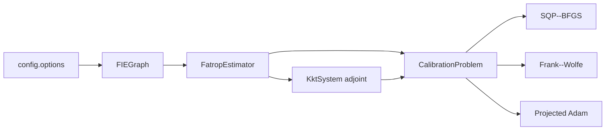

# `legbical` MATLAB package

Package boundary for the structured lower estimator and interchangeable
upper-level calibration methods.

## Subpackages

| Path | Responsibility |
|---|---|
| [`+estimation/`](+estimation/README.md) | Stage graph, Fatrop solve, warm start, KKT factorization, and adjoint pullback |
| [`+calibration/`](+calibration/README.md) | Parameterization, supervised objective, and three upper updates |
| [`+config/`](+config/README.md) | One declared set of dimensions, horizons, bounds, solver options, and loss weights |

The lower problem owns state estimation and local derivatives. The upper
problem receives only the trajectory, loss gradient, and parameter pullback;
all three optimizers therefore evaluate the same estimator and objective.

Return to the [MATLAB implementation](../README.md).
