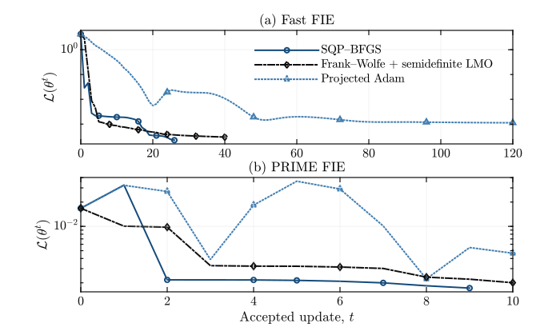
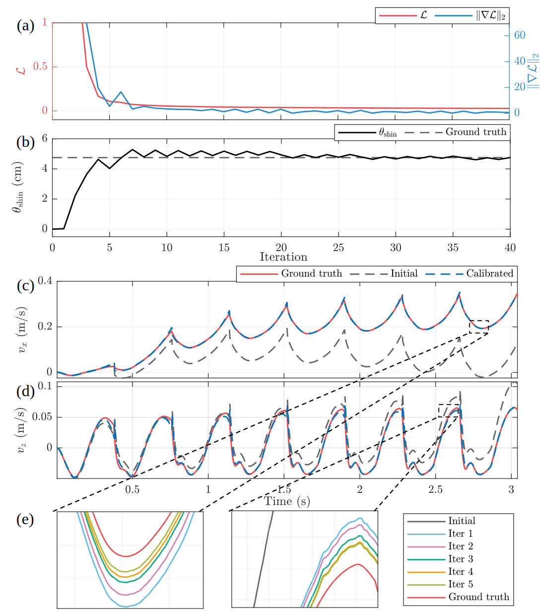

# MATLAB

This implementation combines a stage-structured Fatrop full-information
estimator with an adjoint KKT gradient. SQP--BFGS, Frank--Wolfe, and projected
Adam are provided as interchangeable upper-level updates. The included MAT
file contains the trajectory and precomputed kinematic quantities required by
the example.

<p align="center">
  
</p>
<p align="center"><sub>Upper-level loss convergence for the fast and contact-aware FIEs; see the <a href="../prime/">PRIME implementation</a>.</sub></p>

<p align="center">
  
</p>
<p align="center"><sub>Joint covariance and kinematic calibration on STRIDE.</sub></p>

## Run

MATLAB, Optimization Toolbox, and a CasADi build with Fatrop are required. If
CasADi is not already on the MATLAB path, set `CASADI_MATLAB_PATH`.

```matlab
cd matlab
result = run_calibration(Method="sqp", Horizon="demo");
```

`Method` also accepts `"frank-wolfe"` and `"adam"`; `Horizon="full"` uses the
complete stored trajectory.

## Test

```matlab
addpath('tests');
test_fast_fie
```
