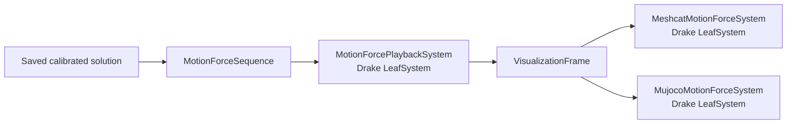

# G1 PRIME covariance calibration

Reproducible bilevel covariance calibration for a Unitree G1 humanoid state
estimator. The lower problem is a fixed-inertia PRIME FDDP estimate with
smoothed second-order-cone contact Newton solves; the upper problem minimizes a
fixed SE(3)-log trajectory loss with SQP--BFGS or Frank--Wolfe--SDP.

[Open the calibrated G1 visualization](https://dlinc3.github.io/LegBiCal/)
on GitHub Pages.

| Calibrated clip | Default replay | Normal speed | Local MuJoCo viewer |
|---|---|---|---|
| run1 | [Meshcat at 0.5x](https://dlinc3.github.io/LegBiCal/media/run1_calibrated.html) | [Meshcat at 1x](https://dlinc3.github.io/LegBiCal/media/run1_calibrated.html?speed=1) | `g1cal replay --clip run1` |
| run2 | [Meshcat at 0.5x](https://dlinc3.github.io/LegBiCal/media/run2_calibrated.html) | [Meshcat at 1x](https://dlinc3.github.io/LegBiCal/media/run2_calibrated.html?speed=1) | `g1cal replay --clip run2` |

The visualizations are built on top of PRIME's excellent estimator
(well-robotics/PRIME, BSD-3). Half speed is the default so that contact forces
remain easy to inspect; each page also has `0.5x` and `1x` controls.

The covariance was calibrated by directly minimizing the SE(3)-log trajectory
loss on the two released 501-state running clips; no accuracy beyond these two
clips is claimed. The released upper problem varies the joint-position
measurement block while keeping the remaining covariance coordinates fixed.

## Quickstart

The default demo reads the shipped calibrated solution bundles and creates
self-contained Meshcat HTML without running the estimator or a simulator.

```bash
# Run from this directory.
conda env create -f environment.yml
conda activate g1cal
./scripts/build.sh
python -m pip install -e .
g1cal demo --out out/demo
```

To rerun one lower problem at the released covariance:

```bash
g1cal solve --clip run1 --covariance data/calibrated/precision.csv
g1cal solve --clip run2 --covariance calibrated
```

The interactive MuJoCo path prescribes `qpos`/`qvel` and calls `mj_forward` at
50 Hz; it does not advance MuJoCo dynamics.

```bash
g1cal replay --clip run1 --source calibrated
```

## Repository map

| Directory | Responsibility |
|---|---|
| [`configs/`](configs/README.md) | Lower-solver, replay-scene, and visualization configuration |
| [`cpp/`](cpp/README.md) | PRIME overlay, lower-solver executable, pybind module, and contact model |
| [`data/`](data/README.md) | Released clips, calibrated covariance, and reference solutions |
| [`docs/`](docs/README.md) | GitHub Pages landing page and deployment instructions |
| [`models/`](models/README.md) | Pinned G1 URDF, MJCF, meshes, contact frames, and manifest |
| [`python/`](python/README.md) | Installable `g1cal` package and complete Drake visualization architecture |
| [`scripts/`](scripts/) | Build, Pages generation, and release-maintenance entry points |
| [`third_party/`](third_party/) | Pinned PRIME source and preserved notices |

## Calibration architecture

```mermaid
flowchart TB
  O[SQP--BFGS or Frank--Wolfe--SDP] --> C[CalibrationOracle]
  C --> V[Block covariance and precision]
  V --> R1[PRIME FDDP + contact Newton<br/>run1, H=501]
  V --> R2[PRIME FDDP + contact Newton<br/>run2, H=501]
  R1 --> J[Mean SE(3)-log trajectory loss]
  R2 --> J
  J --> G[Whole-estimator central difference]
  G --> O
```

Both visualization backends consume the same immutable sequence and Drake
frame contract:



The full Drake/pydrake ownership and port structure is documented under
[`python/g1cal/visualization/`](python/g1cal/visualization/README.md).

## Commands

| Command | Purpose |
|---|---|
| `g1cal demo` | Render both shipped calibrated solutions to Meshcat HTML |
| `g1cal solve` | Run one lower estimator at a selected covariance |
| `g1cal calibrate` | Run SQP--BFGS or Frank--Wolfe--SDP upper updates |
| `g1cal select` | Select the lowest strict evaluated covariance |
| `g1cal render` | Render one saved solution to self-contained Meshcat HTML |
| `g1cal replay` | Open the passive interactive MuJoCo viewer |

Use `g1cal COMMAND --help` for the exact arguments.

## Reproduce the calibration

Both upper methods share a content-addressed two-clip oracle, immutable lower
attempts, a strict promotion gate, and the whole-estimator central finite
difference in the released direction. Runtime depends on hardware and the
available lower-evaluation cache.

```bash
g1cal calibrate --optimizer sqp-bfgs --max-iterations 2 \
  --out out/calibration
g1cal calibrate --optimizer frank-wolfe-sdp --max-iterations 2 \
  --out out/calibration
g1cal select --out out/calibration
```

The Frank--Wolfe linear minimization oracle is solved as an SDP and checked
against the analytic interval endpoint for the released isotropic scalar.

## Acknowledgments and licenses

Built on the excellent work of
[PRIME](https://github.com/well-robotics/PRIME) (well-robotics), BSD-3. PRIME
extends Crocoddyl with the contact machinery used by the lower estimator; its
vendored license and notices are preserved under
[`third_party/PRIME/`](third_party/PRIME/VENDORED.md). Visualizations are built
on top of PRIME's excellent estimator and use its experiment scene palette.

Unitree G1 model material is used under BSD-3-Clause; exact upstream commits
and license texts are recorded in [`models/g1/NOTICE.md`](models/g1/NOTICE.md).
Repository code in this subtree is BSD-3-Clause. Third-party data and model
material remain subject to their respective notices.

Return to the [PRIME implementations](../README.md).
