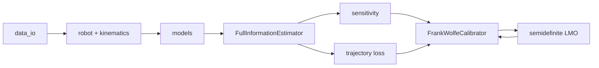

# `bilevel` package

Control plane for the B1 structured estimator and Frank--Wolfe calibration.

## Modules

| Path | Responsibility |
|---|---|
| [`estimator/`](estimator/README.md) | Stage-structured Fatrop NLP and generated KKT derivatives |
| [`calibration.py`](calibration.py) | Shared solve/loss/gradient state, Armijo search, and Frank--Wolfe loop |
| [`sensitivity.py`](sensitivity.py) | Cached sparse transposed-KKT factorization and parameter pullback |
| [`lmo.py`](lmo.py) | CVXPY semidefinite linear minimization oracle and feasible bounds |
| [`losses.py`](losses.py) | Position, velocity, attitude, and kinematic-offset trajectory loss |
| [`robot.py`](robot.py), [`kinematics.py`](kinematics.py) | Pinocchio measurements, frame Jacobians, tip/base offsets, and their derivatives |
| [`models.py`](models.py) | Quaternion process and measurement models shared with the estimator |
| [`data_io.py`](data_io.py) | Validated B1 window extraction and transition alignment |
| [`codegen.py`](codegen.py) | Content-addressed compilation/loading of portable CasADi C functions |
| [`config.py`](config.py) | Parameter slices, horizons, solver settings, and calibration bounds |
| [`run_bilevel.py`](run_bilevel.py) | Installed CLI entry point |

The lower solve preserves stage sparsity and reuses primal/dual warm starts.
One sparse KKT factorization supplies the upper pullback, while the LMO keeps
covariance and kinematic iterates inside the declared feasible set.

Return to the [Python implementation](../README.md).
